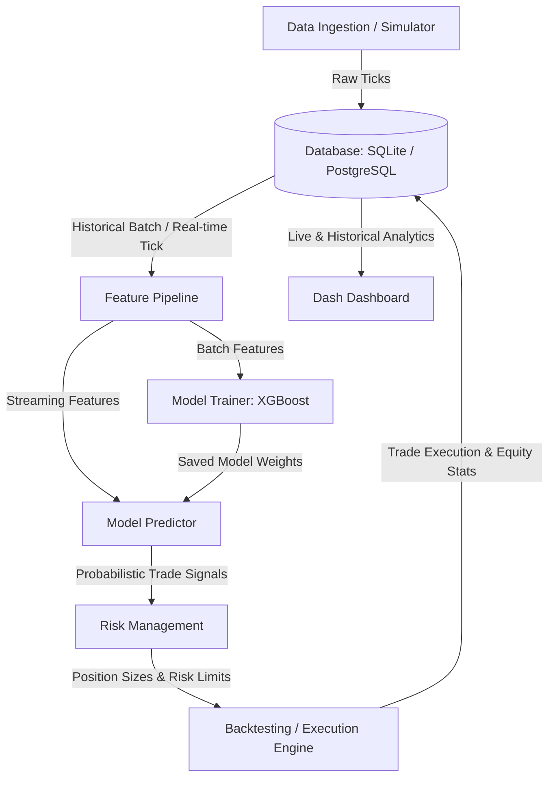

# Real-Time Trading Decision Engine

A production-grade, event-driven quantitative trading system that simulates order book feeds, computes real-time time-series features, makes probabilistic direction forecasts using XGBoost, enforces strict capital preservation constraints (stop-losses, Kelly sizing, and global drawdown halts), backtests strategies, and renders live analytics in an interactive Dash visualization dashboard.

---

## 📊 System Architecture & Data Flow



---

## 🚀 Key Modules & System Features

### 1. Market Data Simulation & Ingestion (`data_simulator.py`)
- **Historical Ingestion**: Pulls historical price bars for target assets (e.g., stocks, crypto) using `yfinance` to seed indicators and train the model. Automatically falls back to synthetic history if offline.
- **High-Frequency Simulator**: Generates real-time price ticks using Geometric Brownian Motion (GBM) with Poisson-distributed order arrivals, mimicking bid/ask order book state and volume distribution.
- **Latency Tracking**: Attaches an exchange timestamp to raw ticks to measure and log ingestion-to-processing system latency.

### 2. Streaming & Batch Feature Pipeline (`features.py`)
- **Technical Indicators**: Vector calculations for Simple Moving Averages (SMA), Exponential Moving Averages (EMA), Relative Strength Index (RSI), MACD, Average True Range (ATR), Bollinger Bands, Rate of Change (Momentum), and Bid-Ask Spread.
- **Dual-Execution Pipeline**:
  - **Batch Mode**: Vectorized calculations across entire DataFrames for model training.
  - **Streaming Mode**: Incremental calculations querying only the necessary rolling history to compute features for the latest tick in sub-milliseconds.

### 3. Machine Learning Predictor (`model.py`)
- **Target Labeling**: Classifies future return directions (0: Down, 1: Neutral, 2: Up) based on a forward price threshold.
- **Model Architecture**: Fits an XGBoost multi-class classifier using chronological time-series splitting to prevent lookahead bias.
- **Probabilistic Forecaster**: Evaluates confidence outputs ($P(\text{Down})$, $P(\text{Neutral})$, $P(\text{Up})$) to scale trade sizing dynamically.

### 4. Dynamic Risk Controller (`risk.py`)
- **Position Sizing**: Blends fractional Kelly Criterion (scaled by XGBoost confidence probabilities) and ATR-based volatility adjustments (targeting a fixed 1% equity risk per trade).
- **capital Preservation**: Dynamic stop-losses and take-profits computed via ATR offsets.
- **Global Halts**: Continuously monitors peak equity and triggers a hard trading halt if portfolio drawdown exceeds 15%.

### 5. Event-Driven Backtest Engine (`backtester.py`)
- Simulates tick-by-tick trading logic over historical segments, factoring in transaction fees, slippage, and position limits.
- Evaluates strategy performance, logging key quant metrics: Total Return, Annualized Sharpe Ratio, Annualized Sortino Ratio, Maximum Drawdown, Win Rate, and Profit Factor.

### 6. Interactive Visual Dashboard (`dashboard.py`)
- Premium dark-themed visualizer built using Plotly and Dash.
- Displays:
  - Candlestick price charts with trade entry/exit overlay markers.
  - Strategy equity growth curves.
  - Real-time gauge representing XGBoost prediction probability distributions.
  - Key Performance Indicator (KPI) cards.
  - Live trade execution ledger.

---

## 🛠️ Installation & Setup

### 1. Prerequisites
- **Python**: Version 3.10+
- **OpenMP** (Required by XGBoost on macOS):
  ```bash
  brew install libomp
  ```

### 2. Installation
Clone the repository and install the dependencies in a virtual environment:
```bash
# Clone the repository
git clone https://github.com/Zura16/Trading-Decision-Engine.git
cd Trading-Decision-Engine

# Create virtual environment
python3 -m venv venv
source venv/bin/activate

# Upgrade pip and install packages
pip install --upgrade pip
pip install -r requirements.txt
```

### 3. Environment Configurations
A default `.env` template is provided:
```ini
DATABASE_URL=sqlite:///trading_engine.db
SYMBOLS=AAPL,MSFT,BTC-USD
MODEL_PATH=xgboost_model.json
LOG_LEVEL=INFO
DASH_PORT=8050
DASH_HOST=127.0.0.1
```

---

## 🖥️ Command Line Usage Guide

The system is managed using the unified orchestrator script `main.py`.

### A. Train the ML Model
Downloads historical training data, calculates batch indicators, fits the XGBoost model, and saves the weights:
```bash
python main.py train --symbols AAPL,MSFT,BTC-USD --days 30
```

### B. Run Strategy Backtests
Runs the event-driven strategy simulation on historical bar data and displays the metrics summary:
```bash
python main.py backtest --symbols AAPL
```

### C. Run Live Trading & Market Simulation
Starts the background GBM order book price feeds and runs the live feature computation, inference, risk evaluation, and paper trading loop:
```bash
python main.py simulate --symbols AAPL,MSFT --interval 1.5
```

### D. Launch the Visualization Dashboard
Launches the web application dashboard:
```bash
python main.py dashboard
```
Open your browser and navigate to `http://127.0.0.1:8050/` to monitor live system execution.

### E. Run Unit Tests
Runs the test suite verifying database functionality, feature equivalence, and risk manager boundaries:
```bash
python -m unittest tests/test_engine.py
```